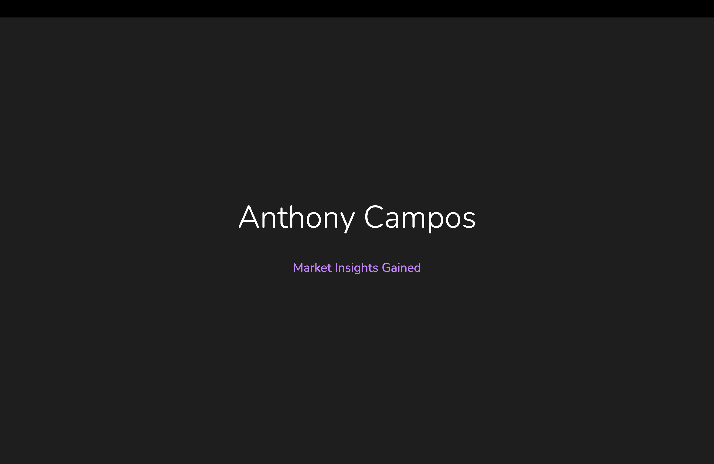
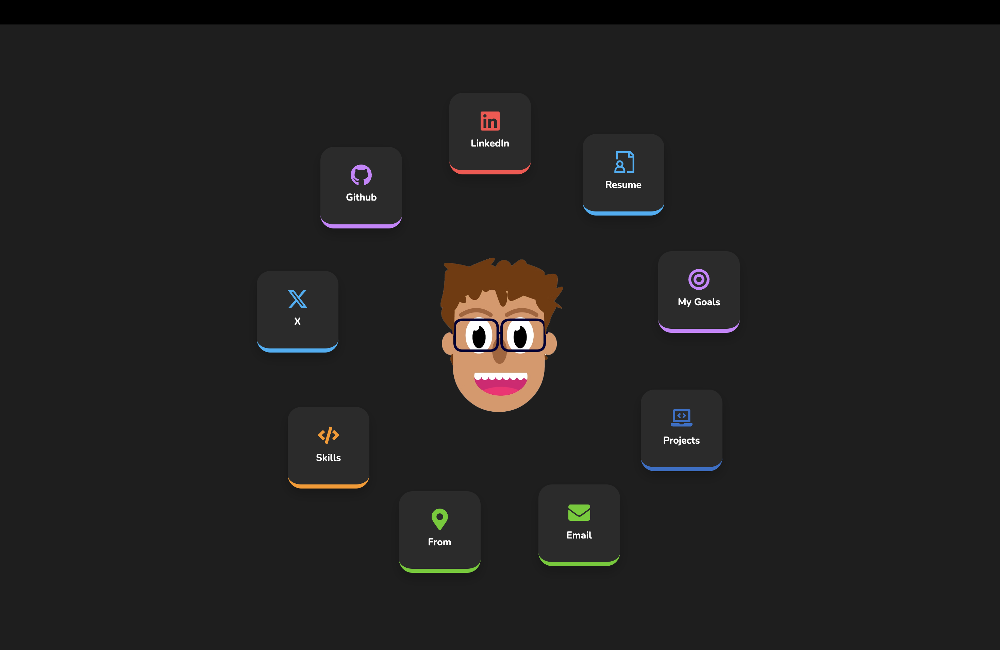

# Anthony Campos Portfolio Website

This repository contains the source code for my personal portfolio website. The website is built using Next.js, React, and TypeScript, showcasing who I am and what I have done.

  
  

## Features

- Responsive design
- Interactive UI elements
- Smooth transitions between pages
- Sections for skills, projects, resume, hobbies, and more

## Technologies Used

- Next.js 14
- React 18
- TypeScript
- Tailwind CSS
- Framer Motion
- React Icons

## Contact

Anthony Campos - [anthonyrubencampos@gmail.com]
